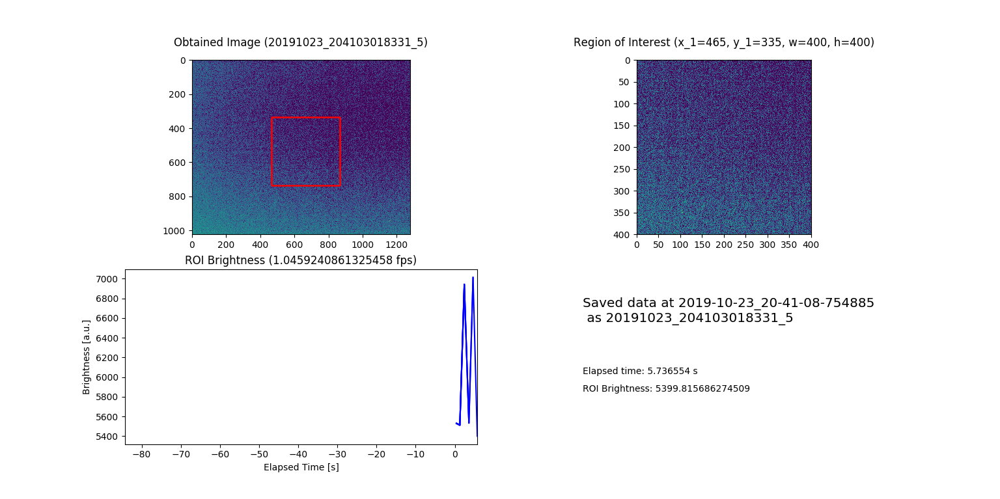

# Profile Monitor Viewer using the Basler Pylon Viewer

last updated 2019.10.23 by n.ozawa

## simplehistostream.py

### Usage

```bash
$ python3 simplehistostream.py
```

### Input/Output

Connect a Basler GigE camera and run script. The image acquired by the camera is displayed as a 2D histogram (subplot 1). A rectangular region of interest (ROI) is defined on the 2D histogram by the four parameters (x_1, y_1, w, h) where (x_1, y_1) is the top-left position, and w and h are the width and height of the ROI. Another 2D histogram is drawn only showing the contents of the ROI region (subplot 2). 

As a rough indication of the beam intensity, the integration of the ROI histogram is calculated. The time evolution of this ROI brightness is plotted as a graph (subplot 3).

Each acquired image, the displayed window, and the brightness values at each time step are saved in the following directory format:

    <base directory of the script>
    └── profile-monitor-images
        └── <run-started-datetime>
                ├── PMImage_<run-started-datetime>.csv
                ├── stream
                │       └── (output figures as ```png``` images)
                └── images
                        └── (acquired images in ```tiff``` format)

where ```<run-started-datetime>``` is in the form of ```YYMMDD_HHMMSSMMMMMM``` and the ```PMImage_<run-started-datetime>.csv``` stores the time elapsed from the start of the run and the ROI brightness obtained at that frame.

### Environment

The aim of this script is to be usable with minimum external libraries. The requirements are

* Python 3.6
* Matplotlib 3.1
* Numpy 1.7
* [Pypylon 1.4](https://github.com/basler/pypylon)
* [Pylon Viewer 5.2 for Linux x86](https://www.baslerweb.com/jp/sales-support/downloads/software-downloads/pylon-5-2-0-linux-x86-64-bit/)

The script has been developed on Ubuntu 18.04 (Windows Subsystem for Linux) along with a Basler ace acA1300-60gm camera.

### Example



## histostream.py

(under construction)

### Environment

The aim of this script is to provide a rapid streaming system using Qt libraries. The requirements are

* Python 3.6
* Matplotlib 3.1
* Numpy 1.7
* [Pypylon 1.4](https://github.com/basler/pypylon)
* [Pylon Viewer 5.2 for Linux x86](https://www.baslerweb.com/jp/sales-support/downloads/software-downloads/pylon-5-2-0-linux-x86-64-bit/)
* [PyQt 5.13](https://pypi.org/project/PyQt5/)
    * PySide2 did not work, although recommended on the PyQtGraph GitHub
* [PyQtGraph 0.11](https://github.com/pyqtgraph/pyqtgraph)
* [libxkbcommon-x11.so.0](https://stackoverflow.com/questions/57503682/matplotlib-qt-wsl-ubuntu-qt5/57503683#57503683)
    * Solutions to any other errors of this sort could be found by running ```export QT_DEBUG_PLUGINS=1``` before running the script

The script has been developed on Ubuntu 18.04 (Windows Subsystem for Linux) along with a Basler ace acA1300-60gm camera.
